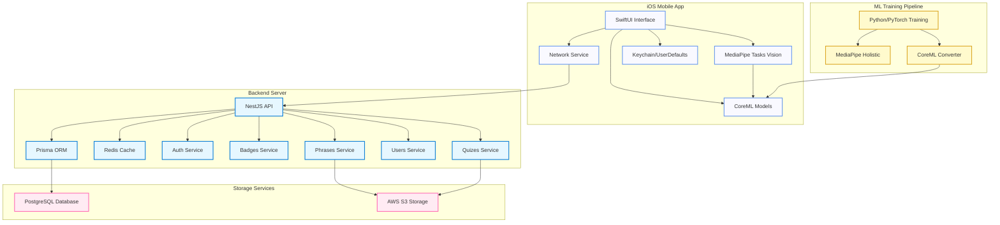

# ASL Learning App: Architecture Overview

Below is a simplified architecture diagram showing the main components of the ASL Learning app ecosystem:

## Architecture Explanation

### Client Side (iOS App)
- **SwiftUI Interface**: Declarative UI framework used to build the user interface
- **CoreML Models**: On-device machine learning models for ASL recognition
- **MediaPipe Tasks Vision**: Framework for processing camera input and detecting hand landmarks
- **Network Service**: Handles all API communication with the backend
- **Local Cache**: Stores authentication tokens and user preferences

### Backend Server
- **NestJS API**: TypeScript-based server framework providing RESTful endpoints
- **Prisma ORM**: Type-safe database client for interacting with PostgreSQL
- **Redis Cache**: In-memory data store for caching frequent requests
- **Service Modules**: Modular architecture with specialized services

### Storage Services
- **PostgreSQL Database**: Primary database storing all application data
- **AWS S3 Storage**: Object storage for ASL videos, GIFs, and other media

### ML Training Pipeline
- **Python/PyTorch Training**: ML model training using deep learning frameworks
- **MediaPipe Holistic**: Framework for extracting full-body pose, face, and hand landmarks
- **CoreML Converter**: Converts trained models to CoreML format for iOS deployment

This architecture follows modern best practices with a clear separation of concerns between frontend, backend, and ML components, while ensuring efficient real-time processing for ASL recognition.
