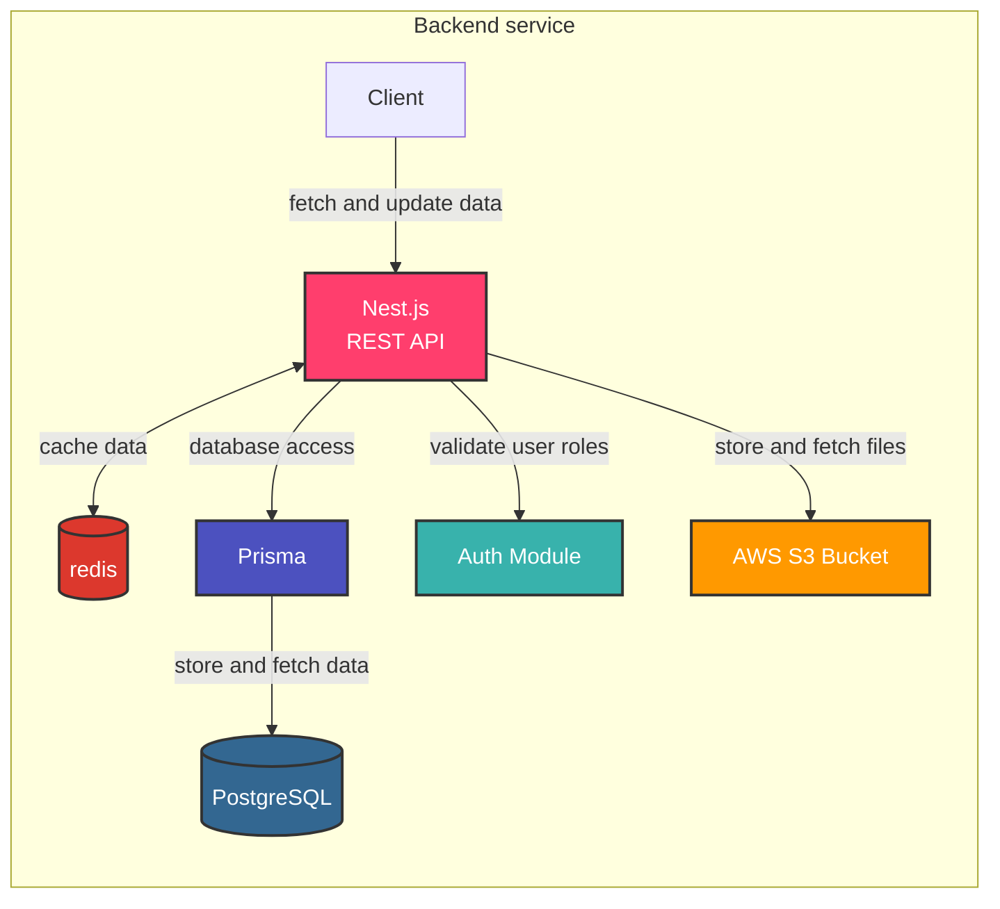

# ASL Learning App Backend Architecture

The backend service architecture of the ASL Learning App is designed with a Nest.js REST API at its core, interacting with various services for data storage, caching, authentication, and file storage.

## Architecture Components

1. **Nest.js REST API**: Core backend service that handles all requests and business logic
2. **Redis**: In-memory data store used for caching frequently accessed data
3. **Prisma**: Database toolkit that provides type-safe database access and schema management
4. **PostgreSQL**: Relational database for persistent data storage
5. **Auth Module**: Handles user authentication and role validation
6. **AWS S3 Bucket**: Cloud storage service for files like images and other media

## Data Flow

- Client applications interact with the backend through the Nest.js REST API
- The API caches frequently accessed data in Redis for improved performance
- Prisma facilitates database access and provides a type-safe interface to interact with PostgreSQL
- User authentication and role validation is handled via the Auth Module
- Files are stored and retrieved from AWS S3 Bucket
