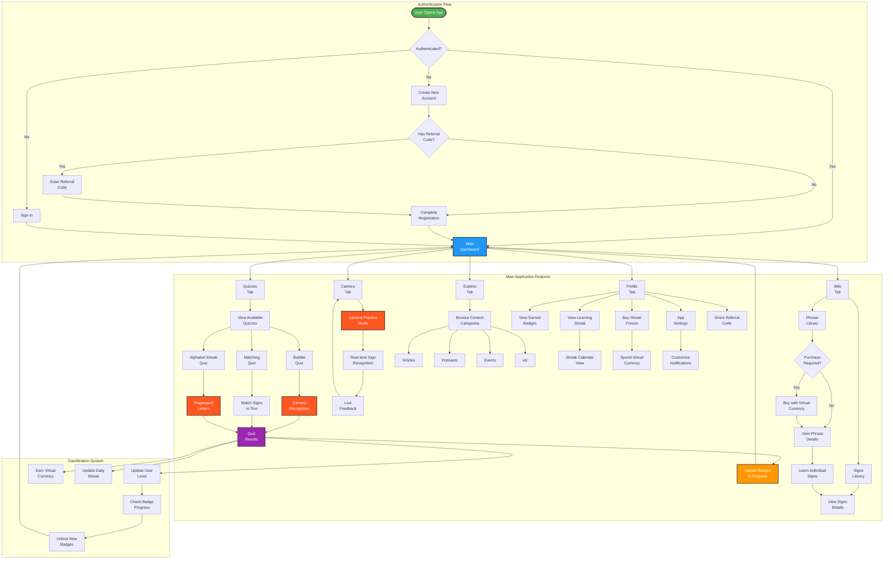

# ASL Learning App User Flow

This diagram illustrates the complete user journey through the ASL Learning mobile application, from initial registration to accessing various learning features.

## User Flow Components

### Authentication & Onboarding
- **Registration**: New users create accounts with optional referral codes for rewards
- **Sign In**: Existing users authenticate with username/email and password
- **Referral System**: Users can benefit from referral codes and share their own

### Core Learning Features
- **Quizzes Tab**: Access to various quiz types (Bubbles, Matching, Alphabet Streak)
- **Camera Tab**: Real-time camera-based sign recognition practice
- **Wiki Tab**: Browse phrase and sign libraries, purchase phrases using virtual currency
- **Explore Tab**: Educational content including articles, podcasts, events, and media

### Gamification Elements
- **Badge System**: Achievement tracking with Bronze, Silver, and Gold rarities
- **Streak System**: Daily learning streaks with freeze purchase options
- **Virtual Currency**: Earned through quizzes and spent on phrases/streak freezes
- **Level Progression**: User advancement based on quiz performance

### Camera Integration
- **Real-time Recognition**: Uses MediaPipe for hand landmark detection
- **Multiple Models**: Simple ASL classifier and Alphabet-specific models
- **Live Feedback**: Immediate visual feedback during practice sessions

The flow emphasizes the app's core value proposition of interactive ASL learning through camera-based recognition, gamified progression, and comprehensive educational content.
The flow emphasizes the app's core value proposition of interactive ASL learning through camera-based recognition, gamified progression, and comprehensive educational content.
